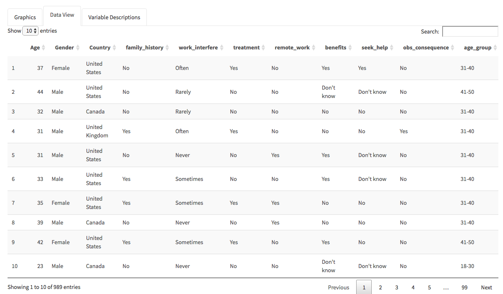
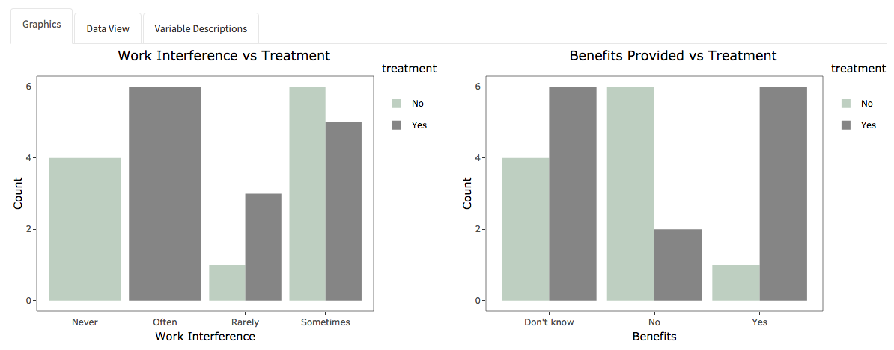

# Milestone 2 Writeup

### Descriptions of the Application

### Functionalities and Rationale

From the eyes of us creators, the application is fairly straight forward to use. There are 3 main components of our app:
1. Tabs
2. Filters
3. Graphics
We will now go into further detail. This is the landing page of our app.

#### Tabs
We have three tabs in our app: Graphics, Data, and Variable Descriptions

The Graphics tab can be seen from the landing page, so a screenshot is not provided. On this tab, users are able to view the plots that we have created based on our filtered data. The filters will be discussed later. We chose to use.... 

The Data View tab, as you can imagine, shows the data in a table format. Users can sort the data by whichever variable they choose. Of course, the data that is shown is also filtered.

Finally, the Variable Descriptions tab simply shows what each variable means. This is provided just in case users are unaware of what each variables mean.

#### Filters

#### Graphics

### Data Extraction

### Prior Visions and Future Goals

As the creators of the application, we both found that we have create a very pleasant application that is easy to use and solves the problem we set out to solve. Overall, our final draft was created with the sketches we drew in milestone 1 in mind. However, with that being said, we definitely have made some changes. We made two very big changes. The first one is that we decided to not implement a map for our visualization application. While we were developing the app, we found that a map that simply showed response rates adds very little value and meaning. Furthermore, to create an effective map would take a lot of time, which we unfortunately do not have this week. The second change we made was that we implemented the use of tabs. Tabs allow users to effectively switch between different views such as graphics or data tables. 

In the future, we hope that we could implement better aesthetics as well as better functionalities to our graphics. For now, the filters seem fairly simple and although they work well, there definitely could be some aesthetic changes.
