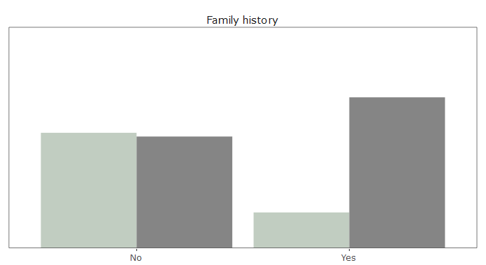
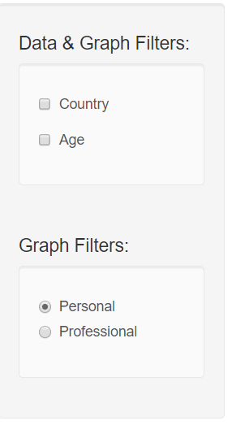

# Milestone 3 Writeup

Authors: Patrick Tung, Orphelia Ellogne

## What changes did we make?

We've implemented four changes for this milestone.

First, we specified the objective of the app by adding a use case below the title : "Need to encourage mental health check-ups ? Consider these factors". Our goal in doing so was to manage users' expectations before they start exploring the app.

Secondly, we improved the aesthetics of the graphs. We enhanced the readability of the plots titles by removing the borders and the colored background. We also removed the unnecessary extra space between the X-axis and the graphs as we do not have any negative values. 

**Before**

**After**

Furthermore, we clarified the usage of the filters by making the labels more descriptive. Previously, it was not clear that the `Type` filter only applies to the graphs while the `Country` and `Age` filters apply to both the data and the graphs.  We changed the labels to `Graph` filters and ` Data & Graphs` filters, respectively. 

**Before**

**After**

Lastly, we’ve realized that we have the following bug when no data is selected: "An error has occurred. Check your logs or contact the app author for clarification". We were not able to fix it given the time constraint, but we changed the error message to "Please select a country or age group". However, we still have an error that shows up when transition between tabs upon starting the app.

## What would we do differently?

After thinking about it for a while and discussing it with each other, we thought, overall, the process of creating this application needed some change. First of all, when we were first assigned this project, we immediately started brainstorming fancy ideas. Since this was our first visualization app ever, we wanted to develop an application that was fancy and “cool-looking”. We envisioned maps and other features that were “cool” to have. However, as the project progressed, we realized that many of these features were simply for show and provides little to no meaning to the application. This ended up wasting some of our time that could have been spent on other essential functions. Another thing that we might change builds off of this idea. Since we ended up spending quite some time on unnecessary features, we thought that it was more important to gets some feedback with our brainstormed ideas before we start developing anything. By getting feedback from peers or TAs on brainstormed ideas, we could get a better idea on what functionalities we should really be focusing on.

## What challenges did we face?

To be honest, while developing our visualization app, we did not really encounter any really large problems. However, we did have some small obstacles every here and there. For example, we noticed that `ggplotly` and `ggplot` did not really work with each other really well. When we converted our graphs from `ggplot` to utilize `ggplotly`, the positioning of our legend labels moved. After a long time of Googling and reading the documentations, we realized that `ggplotly` had some issues when dealing with legend positions from `ggplot`. It ended up taking us a couple of hours to finally resolve this issue using a workaround. Ultimately, the problems that we encountered when developing the app were not difficult. However, they were definitely time consuming as they all required extensive research. These issues only occurred because we were unfamiliar with developing Shiny Apps. I am sure that the next time we create something like this, the process will be much smoother.
